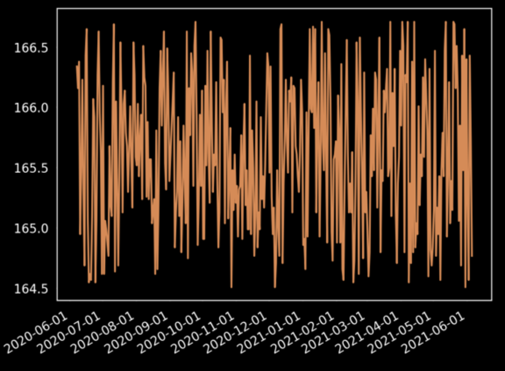

## health-records
[](https://www.gnu.org/licenses/gpl-3.0)

A tool for managing personal health records using plain text. Inspired by the principles of plain text accounting.

The main idea is to maintain your own health records in a text file that can be privately stored in your computer and versioned on a private git repository. The included command line tool can query and plot the data.

Records can be entered by hand using a text editor or imported from your own account from online services like Apple Health, Withings, Strava, etc. The import process can be automated.

Health records can include:
  - body metrics: weight, height, blood pressure, heart rate
  - lab results: blood work, cholesterol levels, glucose
  - immunization: flu vaccine doses, covid-19 vaccine doses
  - medications, eye glasses prescription
  - diagnostics and conditions
  - procedures
  - fitness records: workouts, relative effort, average heart rate

Sample health records:

```
2020-06-07 08:11:00 r 'import from withings - grp 1'
  body.weight 166.34
  body.fat.mass 21.61
  body.fat.ratio 12.99
  body.fat-free.mass 144.73
  body.muscle.mass 133.07
  body.bone.mass 66.54
  body.water 99.8

2020-06-08 00:00:00 r 'import from withings - grp 4'
  body.heart.rate 76
  body.heart.pwv 5.6
```

Sample command to generate a graph with some health data:

```
phr plot body.weight
```



## Install

```
pip install health-records
```


## References

I'm an active user of the great text-based accounting software [beancount](https://beancount.github.io) by Martin Blais. Some of the ideas in `beancount` have been an inspiration for `health-records`.


## Copyright and License

Copyright (C) 2021 Paco G&oacute;mez. All Rights Reserved.

This code is distributed under the terms of the "GNU GPLv3 only". See [LICENSE](./LICENSE) file for details.


## Author

Paco G&oacute;mez [contact@pacogomez.com](mailto:contact@pacogomez.com)
